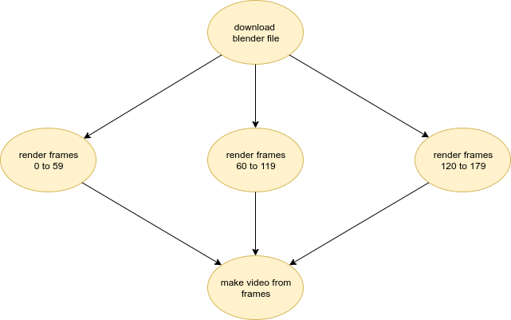

# Blender Rendering Example

This job graph retrieves a blender file, dispatchs rendering jobs, and once they finish builds a video file from the rendered images.
The blender file, the frame images and the final video are stored in a volume mounted out of a persistent volume claim.

